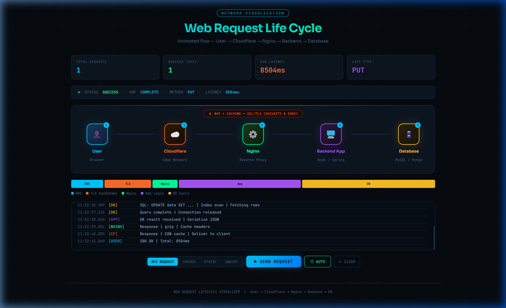
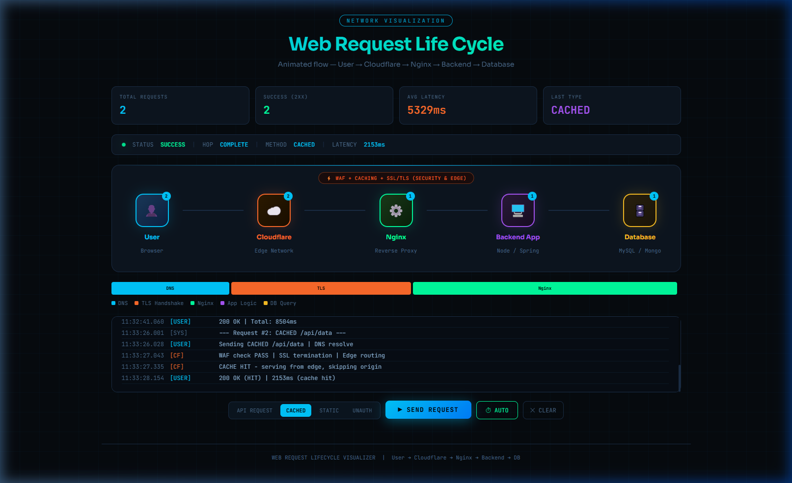
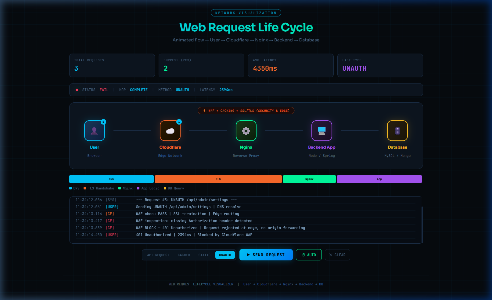

# 🌐 Web Request Life Cycle Visualizer

<div align="center">




</div>

## 📋 Overview

The **Web Request Life Cycle Visualizer** is a high-fidelity, interactive tool designed to demonstrate the step-by-step journey of a data packet in a modern web infrastructure. From the moment a user clicks a button to the final database query and response delivery, this visualizer demystifies complex network concepts through real-time animations and granular performance metrics.

### ✨ Key Features

- 📡 **Real-time Network Flow** - Smooth, animated packet visualization across multiple infrastructure layers.
- 🛡️ **Edge Security Simulation** - Demonstrates Cloudflare WAF checks, SSL/TLS termination, and Edge routing.
- ⚖️ **Proxy & Load Balancing** - Visualizes Nginx reverse proxying and origin packet forwarding.
- 📊 **Performance Analytics** - Real-time tracking of requests, success rates, and average latency.
- ⏱️ **Latency Breakdown** - Granular timing for DNS, TLS Handshake, Nginx, App Logic, and DB Queries.
- 🔄 **Multiple Scenarios** - Simulate API requests, Cache hits, Static asset delivery, and Unauthorized blocks.
- 🤖 **Auto-Simulation Mode** - Sequential execution of various request types for demonstration and training.

</br>

## 🚀 Quick Start

### Prerequisites

- 🌐 **Modern Web Browser** (Chrome, Firefox, Safari, or Edge)
- 💾 **No dependencies** (Standalone HTML/CSS/JS)

### 📥 Installation

1. **Clone the repository:**
   ```bash
   git clone https://github.com/yasith-1/web-request-lifecycle.git
   cd web-request-lifecycle
   ```

2. **Open the Dashboard:**
   Simply open `index.html` in your preferred web browser.

---

## 🛠️ Technology Stack

<div align="center">

| Technology | Purpose | Version |
|------------|---------|---------|
|  | Structure | HTML5 |
|  | Design & Animation | Vanilla |
|  | Visual Logic | ES6+ |
|  | Typography | Sora / JetBrains Mono |

</div>

---

## 🔄️ Scenarios Visualized

<div align="left">

<details>
<summary>🖼️ 1. API Request (Full Cycle)</summary>
  
Shows the request traveling through all 5 hops: User → Cloudflare → Nginx → Backend → Database, complete with business logic processing and DB query visualization.


</details>

<details>

<summary>🖼️ 2. Cached Request (CDN Edge)</summary>

Demonstrates Cloudflare responding directly from the edge cache, skipping origin servers entirely for ultra-low latency.



</details>

<details>

<summary>🖼️ 3. Unauthorized Block (WAF)</summary>

Visualizes how a Web Application Firewall (WAF) rejects unauthorized or suspicious requests at the edge before they can reach your infrastructure.



</details>

*Clean and intuitive dashboard for easy exploration of network flows*

</div>

---

## 📁 Project Structure

```
📦 web-request-lifecycle/
├── 📁 screenshots/        # Visual documentation assets
│   ├── 🖼️ dashboard.png   # Main dashboard overview
│   ├── 🖼️ cached.png      # Cached request flow
│   └── 🖼️ unauth.png      # Unauthorized block flow
├── 📜 index.html          # Unified structure, style, and logic
└── 📜 README.md           # Documentation (You are here)
```

---

## 🎯 Core Functionalities

<div align="center">
   <table>
<tr>
<td width="50%">

### 📡 Network Visualization
- 🔄 Animated flow between 5 nodes
- 🧬 Dynamic packet color coding
- 💫 Glow effects for active connections
- 📊 Real-time log stream
- 🏁 Multi-hop journey tracking

</td>
<td width="50%">

### ⏱️ Latency Analysis  
- 🏗️ Multi-segment timing bar
- 🏷️ DNS & TLS handshake tracking
- ⚙️ Proxy overhead visualization
- 📱 Mobile-responsive timeline
- 📏 Percentage-based time allocation

</td>
</tr>
<tr>
<td width="50%">

### 🔄 Scenario Controller
- 🔌 API Request (standard flow)
- ⚡ Cached (Edge response)
- 📄 Static (Asset delivery)
- 🚫 Unauth (WAF blocking)
- 🤖 Sequential automated mode

</td>
<td width="50%">

### 🎨 Premium UI/UX
- 🌑 Sleek dark theme
- 🔳 Glassmorphism panels
- 🧩 SVG icons & indicators
- 🎹 JetBrains Mono typography
- ✨ Smooth micro-animations

</td>
</tr>
</table>
</div>

---

## 📞 Contact & Support

<div align="center">

### 👨💻 Developer : Yashith Prabhashwara

[](mailto:yasithprabaswara1@gmail.com)
[](https://www.linkedin.com/in/yashith-prabhashwara-a1aa471a6/)
[](https://github.com/yasith-1)

</div>

---

## 🙏 Acknowledgments

- Inspired by the need for simplified DevOps and Network architecture education.
- Thanks to the open-source community for the badges and design inspiration.
- Built with focus on modularity and educational clarity.

---

<div align="center">

### 🌟 If you found this visualizer helpful, please give it a star! 🌟


**Made with ❤️ by [Yasith Prabaswara](https://github.com/yasith-1)**

</div>
